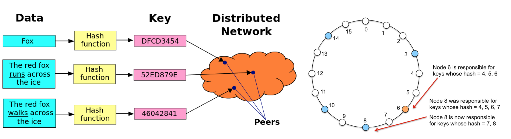

<p align="center">Large-Scale Distributed Systems</br>Peer to Peer Distributed-Hash-Table based on Chord Protocol</br>CSE 586 - Spring 2019 </p>

------




Goal
------
Implement a [**Chord**](https://en.wikipedia.org/wiki/Chord_(peer-to-peer)) based [**Distributed HashTable**](https://en.wikipedia.org/wiki/Distributed_hash_table) functionality on Android devices. Although the design is based on Chord, it is a **simplified version of Chord** i.e we do not need to implement finger tables and finger-based routing; we also do not need to handle node leaves/failures.

There are three things that have to be implemented: - 
```
1. ID space partitioning/re-partitioning
2. Ring-based routing
3. Node joins
```

**NOTE**
if there are multiple instances of the app, all instances should form a **Chord ring** and serve insert/query requests in a distributed fashion according to the Chord protocol


References
---------------
Below sources to design the DHT based on Chord: -</br>
1. [Lecture slides](http://www.cse.buffalo.edu/~stevko/courses/cse486/spring16/lectures/14-dht.pdf)</br>
2. [Chord paper](http://www.cse.buffalo.edu/~stevko/courses/cse486/spring19/files/chord_sigcomm.pdf)</br>
3. [Cloud Computing Concepts - University of Illinois at Urbana-Champaign](https://www.coursera.org/learn/cloud-computing)

Credits
-------
This project contains scripts and other related material that is developed by [**Networked Systems Research Group**](https://nsr.cse.buffalo.edu) at **[University of Buffalo, The State University of New York](http://www.cse.buffalo.edu)**.

I acknowledge and grateful to [**Professor Steve ko**](https://nsr.cse.buffalo.edu/?page_id=272)for his continuous support throughout the Course ([**CSE 586**] (http://www.cse.buffalo.edu/~stevko/courses/cse486/spring19/)) that helped me learn the skills of Large Scale Distributed Systems and develop a simplified version of **Distributed HashTable based on CHORD protocol**.


Developer
---------
Vishal Gawade (vgawade@buffalo.edu)</br>
